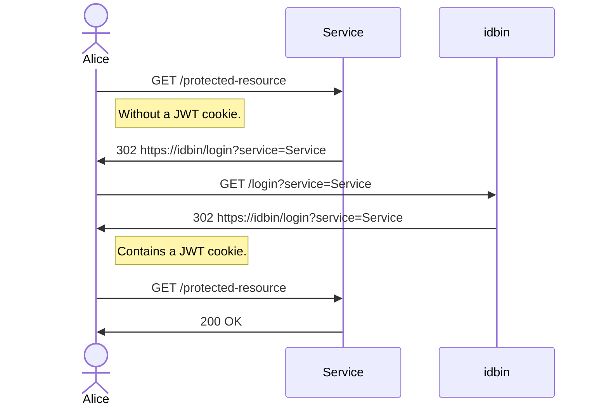

# id

A bunch of projects for managing the identity with Hivecom services.

## idbin

The identity provider for Hivecom services. Hivecom services will redirect to
this in order to let the user authenticate themselves.

The authentication flow looks something like this:

## idlib

A Rust library for the axum web framework for dealing with authentication and
authorization of endpoints.
